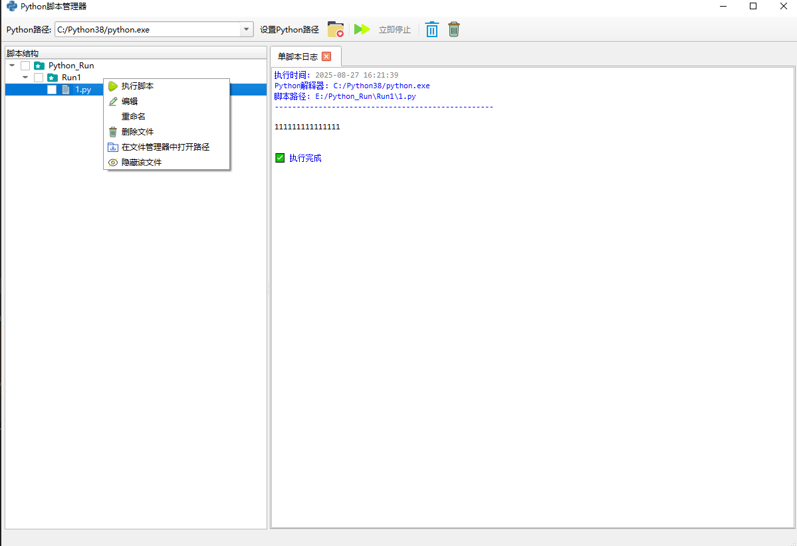

# Python 执行管理器

## ✉️ 页面展示

## 📋 功能概述

### 🐍 Python 环境管理
- 🛠️ 多解释器支持：可添加、编辑、删除多个Python解释器路径
- ✅ 路径验证：自动检测Python解释器是否可用并显示状态
- 💾 持久化配置：自动保存Python路径配置和最后选择项

### 📁 脚本管理
- 🌳 树形结构展示：以树形结构可视化展示文件夹中的Python脚本
- 🔄 动态加载：支持展开文件夹时动态加载内容
- 🔍 文件过滤：自动识别并只显示.py文件
- 📂 多根目录支持：可同时添加多个根文件夹进行管理

### ⚡ 执行功能
- ▶️ 单脚本执行：双击或右键菜单执行单个脚本
- 📊 批量执行：支持勾选多个脚本进行批量顺序执行
- 🗂️ 执行隔离：每次批量执行创建独立的结果标签页
- 📝 实时输出：实时显示脚本执行的标准输出和错误输出

### ✏️ 编辑功能
- 📝 内置代码编辑器：支持语法高亮的代码编辑界面
- 💾 文件保存：支持编辑后保存Python文件
- 🔤 等宽字体：使用Consolas等宽字体保证代码对齐

## 文件管理增强
- 🔁 **文件移动**：
  - 📁 拖拽支持：支持在树形结构中直接拖拽文件/文件夹到目标目录
  - 🚫 循环检测：自动禁止将文件夹拖入自身或子目录
  - 💾 跨磁盘支持：兼容不同磁盘间的文件移动
  - 🔄 自动刷新：移动后自动重载源目录和目标目录

- ✨ **新增文件/文件夹**：
  - 📄 新增文件：右键菜单创建.py文件（自动添加`# 自动创建的Python脚本`注释）
  - 📁 新增文件夹：右键菜单创建子文件夹（支持多级目录）
  - 🧾 名称验证：自动检测名称冲突（同名文件/文件夹提示）
  - 🔄 自动刷新：创建后自动更新目录树显示

- 🖊️ **重命名功能**：
  - 📝 支持重命名：右键菜单实现文件/文件夹重命名
  - 🛡️ 后缀保护：确保Python文件保留[.py]后缀
  - 🧾 名称验证：实时检测重名冲突
  - 🔄 自动同步：更新树节点显示名称和实际路径

- 🗑️ **删除功能**：
  - ❗ 安全删除：显示确认对话框（提示不可逆操作）
  - 📁 文件删除：支持单个文件删除（物理删除）
  - 📂 文件夹删除：递归删除整个目录（物理删除）
  - 🔄 结构更新：同步更新树形结构和父节点状态

## 🎨 界面功能
### 📝 展示相关
- 🎨 语法高亮：Python代码语法高亮（关键字、字符串、注释）
- 🌈 日志高亮：执行日志智能高亮（错误、警告、成功信息等）
- 📑 标签页管理：多标签页显示不同执行结果，支持关闭
- 🖱️ 上下文菜单：文件和文件夹右键提供相关操作
- 📊 状态栏提示：实时显示执行状态和信息

### 🛠️ 实用工具
- 📂 文件管理器集成：支持在系统文件管理器中打开文件位置
- 🔄 文件夹重载：可重新加载文件夹内容
- 🧹 日志清理：支持清空单脚本日志和所有结果栏
- 📋 执行信息记录：记录执行时间、使用的解释器、脚本路径等信息

### 🚀 高级特性
- 🧵 多线程执行：使用独立线程执行脚本，避免界面卡顿
- ⏹️ 执行控制：支持停止正在执行的脚本
- ❗ 错误处理：完善的异常处理和用户提示
- 💻 跨平台支持：支持Windows、macOS和Linux系统

## 🚀 使用示例

1. **添加Python解释器**：点击工具栏上的 设置Python路径 按钮，添加您的Python解释器路径
2. **浏览脚本文件夹**：点击文件夹图标，选择包含Python脚本的目录
3. **执行单个脚本**：双击树形结构中的脚本文件，或在右键菜单中选择"▶️执行脚本"
4. **批量执行**：勾选多个脚本前的复选框，然后点击"📊批量执行"按钮
5. **查看结果**：执行结果会显示在右侧的标签页中，不同颜色表示不同类型的信息

## 📋 系统要求

- 🐍 Python 3.6+
- 📦 PyQt6 库
- 💻 支持的操作系统：Windows 7+/macOS 10.12+/Linux

## 📥 安装步骤

1. 克隆或下载本项目代码
2. 安装所需依赖：`pip install PyQt6`
3. 运行主程序：`python run.py`

## 🎯 使用流程

1. 🛠️ 首先配置Python解释器路径
2. 📂 添加包含Python脚本的文件夹
3. ✅ 在树形结构中勾选需要执行的脚本
4. ▶️ 点击批量执行按钮运行脚本
5. 📊 在结果标签页中查看执行输出

## 🤝 贡献

欢迎提交Issue和Pull Request来帮助改进这个项目！

---

⭐ 如果这个项目对您有帮助，请给它一个Star！
